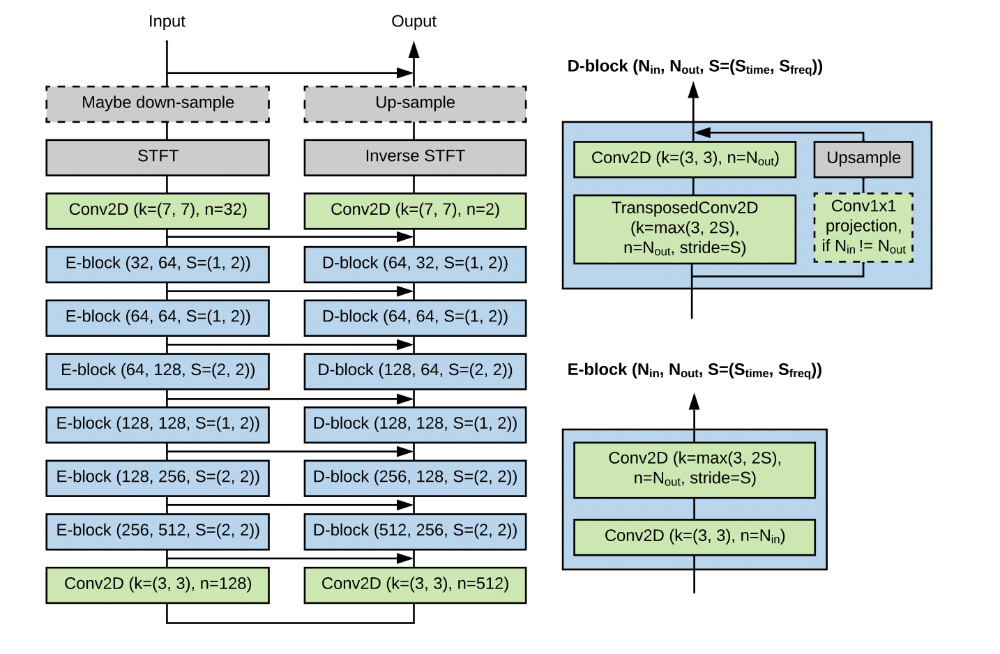

# CycleGan for audio dereverberation

Tiny project for testing out the idea behind [this paper](https://arxiv.org/pdf/2203.15652v1.pdf). The main purpose is to train CycleGAN for dereverberation task on non-parallel data. 


## Architecture and approach

We will utilize complex STFT outputs as 2-channel inputs to the model to avoid using 2-step pipeline with vocoder.

For generator we use UNET, similar to architecture from original paper.



For discriminator we use hifi-gan multi-scale multi-period discriminator as more advanced alternative to MelGan discriminator used in original paper. Note that discriminator takes waveforms as an input.


## Usage

Download the dataset and install dependencies

```bash
sh setup.sh
```


Run training

```bash
python train.py
```

<!-- There are also several ideas from VC1 and VC2 to test out.

## References

[Learning to Denoise Historical Music](https://arxiv.org/pdf/2008.02027.pdf)

[CycleGAN-Based Unpaired Speech Dereverberation](https://arxiv.org/pdf/2203.15652v1.pdf)

[CycleGan-VC](https://arxiv.org/abs/1711.11293)

[CyclGan-VC2](https://arxiv.org/pdf/1904.04631.pdf)

[CyclGan-VC-MASK](https://arxiv.org/pdf/2102.12841.pdf) -->


 